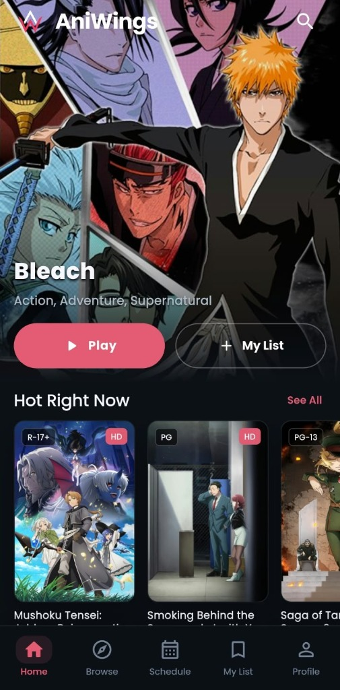
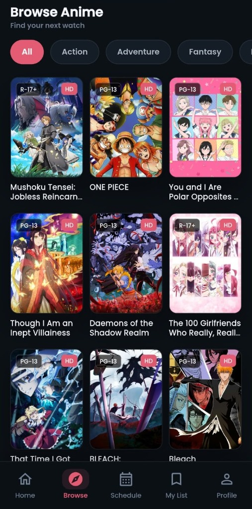
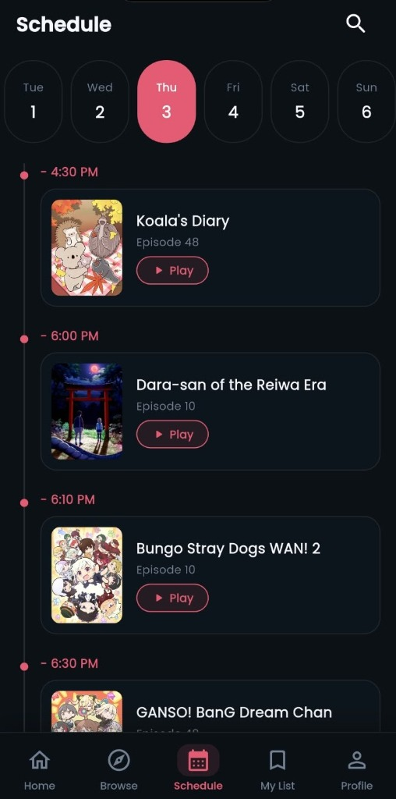
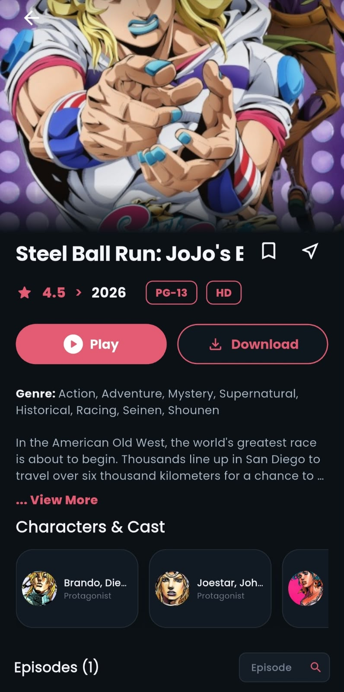
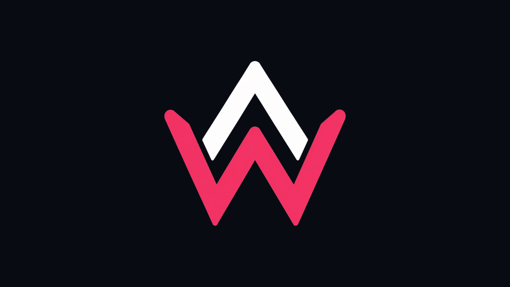

  

<h1 align="center">AniWings — Ad-Free Anime Streaming Client</h1>

  <b>Stream Thousands of HD Anime Episodes & Movies with Zero Ads, No Sign-ups, and Dual Audio (SUB / DUB)</b>

  
  &nbsp;&nbsp;
  
  &nbsp;&nbsp;
  

---

## 🌟 About AniWings

**AniWings** is a dedicated, ad-free anime client engineered for Android Mobiles, Tablets, and Smart TVs. It brings together thousands of HD anime series, movies, and current seasonal simulcasts into a clean, modern interface.

- 🚫 **No Sign-ups Required**: Watch your favorite shows instantly without creating an account or providing email addresses.
- 🛑 **Zero Ads & Pop-ups**: Experience uninterrupted playback without redirect ads or intrusive banners.
- 🔒 **100% Safe & Secure**: Operates without root access, tracking services, or background telemetry.

### 📱 App Screenshots

| 🏠 Home | 🔍 Browse | 📅 Schedule | 🎬 Details |
| :---: | :---: | :---: | :---: |
|  |  |  |  |

---

## 📥 Direct Download & Installation

### 📱 Android Mobiles & Tablets (v1.1.4)

| Build Variant | Architecture | Download Link | Status |
| :--- | :--- | :--- | :--- |
| **Universal APK** | All Devices (Recommended) | [📥 **Download Universal APK**](https://github.com/thehakaiben-cmyk/aniwings-app/releases/download/v1.1.4/AniWings-universal.apk) | 🟢 Live |
| **ARM64-v8a APK** | High-End Mobile Devices | [⚡ **Download ARM64 APK**](https://github.com/thehakaiben-cmyk/aniwings-app/releases/download/v1.1.4/AniWings-arm64-v8a.apk) | 🟢 Live |
| **armeabi-v7a APK** | Low-End / Legacy Devices | [📱 **Download ARMv7 APK**](https://github.com/thehakaiben-cmyk/aniwings-app/releases/download/v1.1.4/AniWings-armeabi-v7a.apk) | 🟢 Live |

---

### 📺 Android TV & Smart TV Boxes (v1.2.1)

  

| Build Variant | Architecture | Download Link | Status |
| :--- | :--- | :--- | :--- |
| **Universal TV APK** | All Smart TVs & TV Boxes | [📺 **Download TV Universal APK**](https://github.com/thehakaiben-cmyk/aniwings-app/releases/download/tv-v1.2.1/aniwings-tv-v1.2.1-universal.apk) | 🟢 Live |
| **ARM64-v8a TV APK** | High-End Smart TVs | [⚡ **Download TV ARM64 APK**](https://github.com/thehakaiben-cmyk/aniwings-app/releases/download/tv-v1.2.1/aniwings-tv-v1.2.1-arm64-v8a.apk) | 🟢 Live |
| **armeabi-v7a TV APK** | Low-End / Legacy TV Boxes | [🕹️ **Download TV ARMv7 APK**](https://github.com/thehakaiben-cmyk/aniwings-app/releases/download/tv-v1.2.1/aniwings-tv-v1.2.1-armeabi-v7a.apk) | 🟢 Live |

---

### 🍏 iOS (iPhone & iPad)

| Platform | Download Link | File Format | Status |
| :--- | :--- | :--- | :--- |
| **iOS (iPhone & iPad)** | *Coming Soon* | `.ipa` | 🟡 In Development |

---

### 📱 Installing on Android Phones & Tablets

1. Tap one of the **Android Mobile APK** links above to download the APK file onto your device.
2. Go to **Settings** > **Security** (or **Apps & Notifications**) and enable **Install from Unknown Sources**.
3. Open your **Downloads** folder, tap the downloaded APK, and click **Install**.

---

### 📺 Installing on Android TV & Smart TV Boxes

#### Option 1: Via Downloader App (Recommended)
1. Install **Downloader by AFTVnews** from the Google Play Store on your Android TV.
2. Open Downloader and enter `https://ani-wings.web.app` or one of the direct TV APK links above.
3. Download the TV-optimized APK and follow the installation prompt.

#### Option 2: Via USB Flash Drive
1. Download `aniwings-tv-v1.2.1-universal.apk` on a PC or phone.
2. Transfer the file to a USB flash drive and insert it into your Android TV box.
3. Use a file manager app on your TV (such as *AnExplorer* or *File Commander*) to open the USB drive and install.

---

## ✨ Features Highlight

- 🛡️ **Zero Advertisements**: Pure streaming experience without pop-up redirects or video ads.
- 🗣️ **Dual Audio Options**: Easily toggle between Subtitled (**SUB**) and Dubbed (**DUB**) audio tracks.
- ⚡ **Buffering-Free Player**: High-speed content delivery network (CDN) for fast HD playback.
- 📅 **Daily Simulcast Sync**: New episodes updated daily alongside Japanese TV broadcasts.
- ⭐ **Custom Library & Watchlists**: Track watched episodes and organize completed and ongoing shows.
- 📺 **TV Remote Compatible**: Engineered with full D-pad remote control support for Smart TVs.

---

## 👥 Community & Official Links

- 💬 **Discord**: [Join AniWings Discord Community](https://discord.gg/5WBhW723uB)
- 📢 **Telegram**: [Join AniWings Telegram Channel](https://t.me/aniwings_off)
- 🔴 **Reddit**: [r/AniWings_Official Subreddit](https://www.reddit.com/r/AniWings_Official/)
- 🌐 **Official Website**: [ani-wings.web.app](https://ani-wings.web.app/)

---

  <i>Built with ❤️ for anime lovers worldwide.</i>

