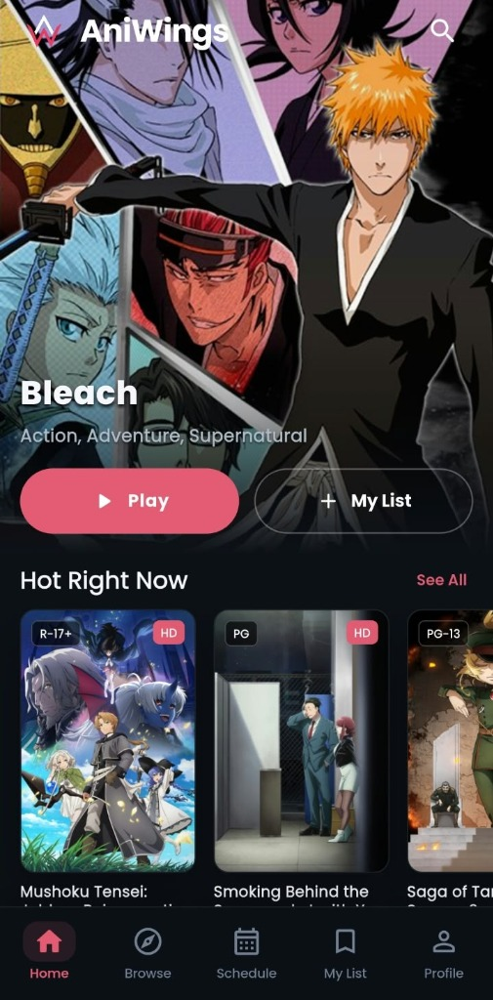
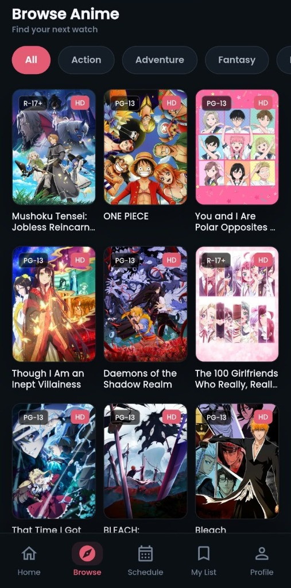
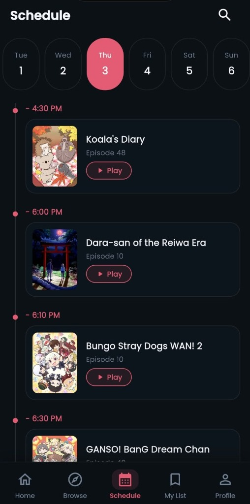
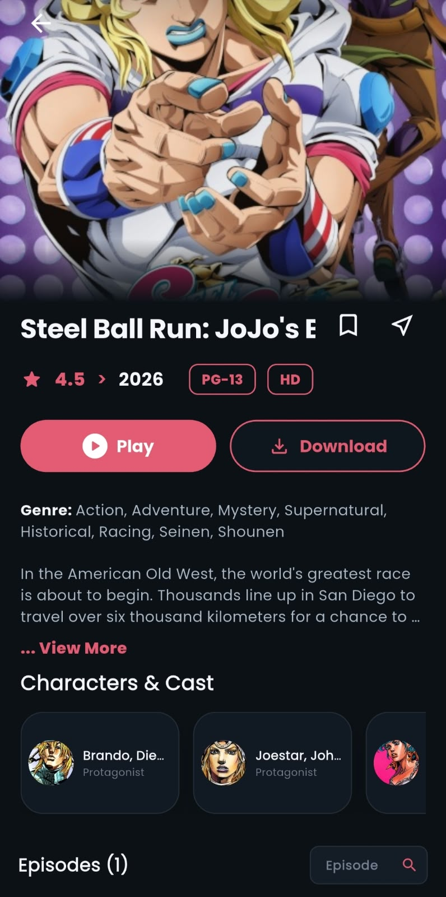

<div align="center">


# AniWings 🪽

### Modern Anime Streaming for Android & Android TV

**Clean UI · SUB & DUB · Extensions · Downloads · Anime Tracking · Android TV**

<br>

[](https://github.com/thehakaiben-cmyk/aniwings-app/releases/download/v1.2.4/AniWings-universal.apk)
[](https://github.com/thehakaiben-cmyk/aniwings-app/releases/download/tv-v1.2.4/aniwings-tv-v1.2.4-universal.apk)
[](https://github.com/thehakaiben-cmyk/aniwings-app/releases/download/v1.2.5/aniwings-desktop-windows-v1.2.5.exe)
[](https://ani-wings.web.app/)

<br>

[](https://github.com/thehakaiben-cmyk/aniwings-app/releases)


<br>

**[Download](#-downloads) • [Features](#-features) • [Extensions](#-mobile-extension-support) • [Screenshots](#-screenshots) • [Installation](#-installation) • [Community](#-community)**

</div>

---

## 🪽 What is AniWings?

**AniWings** is a modern anime streaming client designed for **Android phones, tablets, Android TV, Google TV, Amazon Fire TV, and NVIDIA Shield TV**.

Discover anime, browse seasonal releases, follow airing schedules, manage your library, track episodes, use multiple providers, install provider extensions, download supported episodes, and watch through an interface designed specifically for both mobile devices and televisions.

> **No mandatory AniWings account. No intrusive advertising. Just anime.**

### Why AniWings?

- 🚫 **No Mandatory Sign-up** — Start browsing and watching without creating an AniWings account.
- 🎨 **Modern Interface** — A redesigned experience built for phones, tablets, and televisions.
- 🎬 **Multiple Providers** — Switch between available streaming sources when needed.
- 🔌 **Extension Support** — Expand AniWings Mobile with additional provider extensions.
- ⬇️ **Offline Downloads** — Download supported episodes for offline viewing.
- 📊 **Anime Tracking** — Support for AniList, MyAnimeList, Kitsu, and AniDB.
- 📺 **Dedicated TV Experience** — TV-optimized layouts with full D-pad navigation.
- 🗣️ **SUB & DUB** — Access subtitled and dubbed sources where available.

---

# 📸 Screenshots

<div align="center">

| 🏠 Home | 🔍 Browse | 📅 Schedule | 🎬 Details |
| :---: | :---: | :---: | :---: |
|  |  |  |  |

</div>

---

# 📥 Downloads

## 📱 Android Mobile — v1.2.4

Choose the build that best matches your Android device.

| Build | Recommended For | Download |
| --- | --- | :---: |
| **Universal** | Most Android devices | [](https://github.com/thehakaiben-cmyk/aniwings-app/releases/download/v1.2.4/AniWings-universal.apk) |
| **ARM64-v8a** | Modern 64-bit devices | [](https://github.com/thehakaiben-cmyk/aniwings-app/releases/download/v1.2.4/AniWings-arm64-v8a.apk) |
| **armeabi-v7a** | Older 32-bit devices | [](https://github.com/thehakaiben-cmyk/aniwings-app/releases/download/v1.2.4/AniWings-armeabi-v7a.apk) |

> 💡 **Not sure which one to download?** Choose the **Universal APK**.

---

## 📺 Android TV — v1.2.4

Optimized for **Android TV, Google TV, Amazon Fire TV, NVIDIA Shield TV, and compatible Android TV boxes**.

| Build | Recommended For | Download |
| --- | --- | :---: |
| **Universal TV** | Most TVs & TV boxes | [](https://github.com/thehakaiben-cmyk/aniwings-app/releases/download/tv-v1.2.4/aniwings-tv-v1.2.4-universal.apk) |
| **ARM64-v8a TV** | Modern 64-bit TV devices | [](https://github.com/thehakaiben-cmyk/aniwings-app/releases/download/tv-v1.2.4/aniwings-tv-v1.2.4-arm64-v8a.apk) |
| **armeabi-v7a TV** | Older TV boxes | [](https://github.com/thehakaiben-cmyk/aniwings-app/releases/download/tv-v1.2.4/aniwings-tv-v1.2.4-armeabi-v7a.apk) |

> 📺 For most televisions and TV boxes, choose the **Universal TV APK**.

---

## 💻 Desktop (Windows & Linux) — v1.2.5

Native desktop builds for **Windows 10/11** and **Linux distributions**.

| Build | Recommended For | Download |
| --- | --- | :---: |
| **Windows (.exe)** | Windows 10 & 11 (64-bit) | [](https://github.com/thehakaiben-cmyk/aniwings-app/releases/download/v1.2.5/aniwings-desktop-windows-v1.2.5.exe) |
| **Linux (.AppImage)** | Universal Linux (x86_64) | [](https://github.com/thehakaiben-cmyk/aniwings-app/releases/download/v1.2.5/aniwings-desktop-linux-v1.2.5.AppImage) |

> 💻 Choose the **Windows (.exe)** setup for Windows PCs, or the standalone **Linux (.AppImage)** for Linux distributions.

---

## 🍎 iOS

| Platform | File Format | Status |
| --- | :---: | :---: |
| **iPhone & iPad** | `.ipa` | 🚧 In Development |

iOS support is planned for a future AniWings release.

---

# ✨ Features

## 🎬 Streaming

AniWings provides multiple ways to find and watch supported anime content.

- 🗣️ **SUB & DUB Support** — Switch between subtitled and dubbed sources where available.
- 🌐 **Multiple Streaming Providers** — Choose between different available providers and servers.
- 🇮🇳 **Multi-Audio Support** — Additional language options, including Indian-language sources where available.
- ⚡ **Optimized Playback** — Improved source handling and buffering behavior.
- 🎞️ **Multiple Resolutions** — Select available video qualities depending on the provider.
- 🔄 **Fallback Providers** — Switch to alternative sources when another provider is unavailable.
- 🔍 **Anime & Episode Search** — Quickly find anime and individual episodes.
- 📅 **Airing Schedule** — Keep track of currently airing and upcoming episodes.

---

# 🔌 Mobile Extension Support

> ### 📱 Available on AniWings for Android Mobile

AniWings Mobile includes a modular **extension-based provider system** that allows users to expand the app with additional anime providers instead of relying entirely on the built-in servers.

### 🧩 Extension Manager

Install and manage supported provider extensions directly through AniWings.

Extensions can add their own:

- 🔍 Anime search
- 📚 Anime catalogs
- 📄 Anime information
- 🎞️ Episode lists
- 🎬 Streaming sources
- 🌐 Provider-specific functionality

### ⚡ How Extensions Work

Installed extensions operate separately from AniWings' built-in providers.

Once a compatible extension is installed, its supported sources can become available inside AniWings as additional provider options.

This gives the mobile app a more flexible architecture where additional compatible providers can be added without requiring every provider to be bundled directly into the main AniWings application.

### 🔧 Extension Features

- 🧩 **Install Extensions** — Add supported provider extensions from the Extension Manager.
- 📦 **Extension Management** — Manage installed provider extensions directly inside the app.
- 🔍 **Extension Search** — Search supported anime using installed extensions.
- 📺 **Additional Sources** — Extensions can provide additional episodes and playable sources.
- 🔄 **Independent Providers** — Extension providers work separately from built-in AniWings servers.
- ⚡ **Dynamic Provider Loading** — Installed extensions can appear as additional source options.
- 🛠️ **Expandable Architecture** — Additional compatible providers can be supported over time.
- 🌐 **Provider Flexibility** — Users aren't limited exclusively to AniWings' built-in server selection.

> **Note:** The Extension Manager is currently a **Mobile-only feature**. Extensions are not currently supported by the Android TV version. Availability and functionality can vary between individual extensions.

---

# 📱 Android Mobile Features

| Feature | Support |
| --- | :---: |
| 🔌 Extension System | ✅ |
| 🧩 Extension Manager | ✅ |
| 🎬 Built-in Providers | ✅ |
| ⬇️ Episode Downloads | ✅ |
| 🌐 Custom DNS | ✅ |
| 🗣️ SUB / DUB Sources | ✅ |
| 🇮🇳 Multi-Audio Sources | ✅ |
| 📅 Airing Schedule | ✅ |
| 🔍 Anime & Episode Search | ✅ |
| 👤 Profile Customization | ✅ |
| 📊 Anime Tracking | ✅ |
| ⭐ Library & Watchlists | ✅ |

---

# 📊 Tracking & Metadata

AniWings gives users control over supported anime metadata and tracking providers.

<div align="center">


</div>

### Available Features

- ⭐ **Custom Library & Watchlists**
- ▶️ **Continue Watching**
- 📊 **Watch Progress Tracking**
- 👤 **Profile Customization**
- 🔄 **User-Controlled Provider Selection**
- 🔍 **Anime Metadata**
- 👥 **Character Information**

---

# ⬇️ Offline Viewing

AniWings Mobile supports episode downloads for offline viewing where supported.

Download episodes directly to your device and access them later without having to stream the episode again.

> Download availability can depend on the selected provider and source.

---

# 🌐 Custom DNS

AniWings Mobile includes configurable **DNS options** for supported network connections.

Users can select or configure available DNS options directly through the application instead of changing the DNS configuration for their entire Android device.

---

# 📺 AniWings for Android TV

AniWings isn't just stretched from a phone interface onto a television.

The TV version includes a dedicated interface designed specifically for large screens and remote controls.

### 📺 TV Features

- 🎮 **Full D-pad Navigation**
- 📱 **QR Login through AniWings Mobile**
- 🌈 **HDR Support**
- 🎨 **Display Color Correction**
- ⚡ **TV-Optimized Interface**
- 🎬 **Multiple Streaming Providers**
- 🗣️ **SUB & DUB Sources**
- 📅 **Anime Schedule**
- ▶️ **Continue Watching**
- ⭐ **Library Support**

### Supported TV Platforms

| Platform | Support |
| --- | :---: |
| Android TV | ✅ |
| Google TV | ✅ |
| Amazon Fire TV | ✅ |
| NVIDIA Shield TV | ✅ |
| Android TV Boxes | ✅ |

---

# 🔗 Mobile ↔ TV QR Login

AniWings Mobile can be used to connect with the Android TV version through **QR code pairing**.

Instead of manually entering account information using a television remote:

1. Open AniWings on your TV.
2. Select the QR login option.
3. Open AniWings on your Android phone.
4. Scan the QR code displayed on your television.
5. Complete the connection through the mobile app.

This makes signing in and linking the TV experience much easier.

---

# 📲 Installation

<details>

<summary><b>📱 Android Phone / Tablet</b></summary>

<br>

1. Download the **Universal APK** or the architecture-specific APK from the Downloads section.
2. Open the downloaded APK.
3. If Android blocks the installation, allow **Install unknown apps** for the browser or file manager you used.
4. Tap **Install**.
5. Open AniWings.

</details>

<br>

<details>

<summary><b>📺 Android TV — Downloader Method</b></summary>

<br>

### Recommended Method

1. Install **Downloader by AFTVnews** on your Android TV or compatible device.
2. Open Downloader.
3. Enter:

```text
https://aniwings-app.pages.dev
```

4. Open the Android TV download section.
5. Download the latest **Universal TV APK**.
6. Allow installation from unknown sources if Android TV requests permission.
7. Install AniWings.
8. Launch the app.

</details>

<br>

<details>

<summary><b>💾 Android TV — USB Method</b></summary>

<br>

1. Download:

```text
aniwings-tv-v1.2.4-universal.apk
```

2. Copy the APK to a USB flash drive.
3. Connect the USB drive to your TV or TV box.
4. Open the USB drive using a file manager.
5. Select the AniWings APK.
6. Allow installation from unknown sources if required.
7. Install and launch AniWings.

</details>

---

# 🖥️ Platform Support

| Platform | AniWings |
| --- | :---: |
| 📱 Android Phone | ✅ |
| 📱 Android Tablet | ✅ |
| 📺 Android TV | ✅ |
| 📺 Google TV | ✅ |
| 🔥 Amazon Fire TV | ✅ |
| 🛡️ NVIDIA Shield TV | ✅ |
| 🍎 iPhone | 🚧 Coming Soon |
| 🍎 iPad | 🚧 Coming Soon |

---

# ⚖️ Mobile vs TV

Some features are platform-specific.

| Feature | 📱 Mobile | 📺 TV |
| --- | :---: | :---: |
| Anime Streaming | ✅ | ✅ |
| SUB / DUB | ✅ | ✅ |
| Multiple Providers | ✅ | ✅ |
| Extension System | ✅ | ❌ |
| Extension Manager | ✅ | ❌ |
| Episode Downloads | ✅ | — |
| Custom DNS | ✅ | — |
| Profile Customization | ✅ | — |
| Anime Tracking | ✅ | ✅ |
| Airing Schedule | ✅ | ✅ |
| QR Login Controller | ✅ | — |
| QR Login Receiver | — | ✅ |
| D-pad Navigation | — | ✅ |
| HDR Support | — | ✅ |
| Fire TV Support | — | ✅ |
| NVIDIA Shield TV | — | ✅ |

---

# 🆘 Help & Support

Having trouble with AniWings?

Before reporting an issue:

1. Make sure you're using the **latest AniWings version**.
2. Try another available provider or server.
3. If you're using an extension, try another installed extension.
4. Check whether the problem happens with another anime or episode.
5. Restart AniWings.
6. If you're upgrading from an older incompatible build, uninstall the previous version and install the latest release.

### 🐛 Reporting Bugs

When reporting an issue, including the following information will make troubleshooting much easier:

```text
Device:
Android Version:
AniWings Version:
Mobile / TV:
Anime:
Episode:
Provider / Extension:
Issue:
```

Please avoid including private account information, email addresses, passwords, or other sensitive information in public bug reports.

---

# 👥 Community

Stay updated with AniWings development, report bugs, suggest features, or just talk about anime.

| Platform | Community |
| --- | --- |
| 💬 **Discord** | [Join AniWings Discord](https://discord.gg/5WBhW723uB) |
| 📢 **Telegram** | [Join AniWings Community](https://t.me/aniwings_community) |
| 🔴 **Reddit** | [r/AniWings_Official](https://www.reddit.com/r/AniWings_Official/) |
| 📥 **Download Portal** | [aniwings-app.pages.dev](https://aniwings-app.pages.dev/) |
| 🌐 **Website** | [ani-wings.web.app](https://ani-wings.web.app/) |

---

# ⚠️ Disclaimer

AniWings is an independent anime client.

AniWings does not own or host anime content made available through third-party providers or extensions.

Third-party providers and extensions operate independently, and their availability, functionality, content, languages, subtitles, dubbed audio, resolutions, and streaming sources may change or become unavailable.

All anime titles, artwork, trademarks, logos, and related intellectual property belong to their respective owners.

---

<div align="center">


## AniWings 🪽

### Watch. Discover. Track.

**Built with ❤️ for anime fans.**

<br>

[](https://discord.gg/5WBhW723uB)
[](https://t.me/aniwings_community)
[](https://www.reddit.com/r/AniWings_Official/)

<br>

**[⬆ Back to Top](#aniwings-)**

</div>
